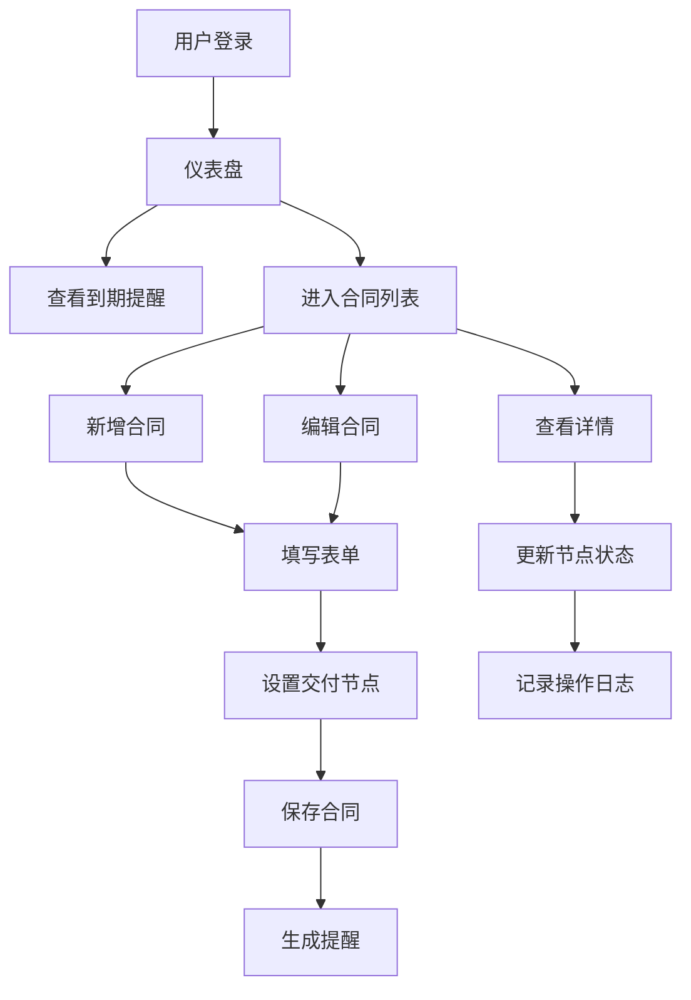

# 合同管理系统 - 产品需求文档

## 1. 产品概述

本系统是一个面向企业内部的**交易合同全生命周期管理平台**，用于真实记录、追踪和管理公司内的各类交易合同。核心解决合同到期提醒、交付节点管控、合同状态追踪等企业管理痛点，适用于各类中小型企业的法务、采购、销售及财务部门协同工作。

## 2. 核心功能

### 2.1 用户角色

| 角色 | 说明 | 核心权限 |
|------|------|----------|
| 管理员 | 系统管理人员 | 合同增删改查、用户管理、数据导出、系统配置 |
| 普通用户 | 业务人员 | 合同查看、新增、编辑（自己创建的）、提醒查看 |

### 2.2 功能模块

1. **合同总览仪表盘**：统计卡片、到期提醒、待办事项、合同状态分布
2. **合同列表页**：高级筛选、分页展示、批量操作、导出Excel
3. **合同详情页**：合同完整信息、交付节点时间线、附件管理、操作日志
4. **合同新增/编辑**：表单录入、日期选择、交付节点设置、附件上传
5. **到期提醒中心**：即将到期合同、已逾期合同、提醒设置
6. **系统设置**：用户管理、合同类型配置、提醒规则

### 2.3 页面详情

| 页面名称 | 模块名称 | 功能描述 |
|----------|----------|----------|
| 仪表盘 | 统计卡片 | 展示合同总数、本月到期、已逾期、进行中数量 |
| 仪表盘 | 到期提醒列表 | 展示未来30天内即将到期的合同 |
| 仪表盘 | 待办事项 | 展示近期需要交付/付款的合同节点 |
| 合同列表 | 筛选区 | 按类型、状态、日期范围、客户名称筛选 |
| 合同列表 | 表格区 | 展示合同编号、名称、客户、金额、状态、到期日 |
| 合同详情 | 基本信息 | 展示合同所有字段信息 |
| 合同详情 | 交付节点 | 时间线形式展示各阶段交付/付款节点 |
| 合同详情 | 操作记录 | 记录合同的创建、修改历史 |
| 合同表单 | 基础信息 | 合同编号、名称、类型、客户、金额等 |
| 合同表单 | 日期设置 | 签订日期、生效日期、到期日期 |
| 合同表单 | 交付节点 | 动态添加多个交付/付款节点 |
| 提醒中心 | 即将到期 | 7天/30天内到期合同 |
| 提醒中心 | 已逾期 | 已过期未处理的合同 |

## 3. 核心流程

### 3.1 合同创建流程

用户进入合同列表 → 点击"新增合同" → 填写基础信息（编号、名称、客户、金额）→ 设置日期（签订、生效、到期）→ 添加交付节点（如：首付款、中期交付、尾款）→ 上传附件 → 保存 → 系统生成提醒

### 3.2 合同到期提醒流程

系统每日检查 → 识别7天内到期合同 → 在仪表盘和提醒中心高亮显示 → 用户查看处理 → 可续签或标记完成

### 3.3 交付节点追踪流程

合同创建时设置节点 → 节点到期前提醒 → 用户确认交付/收款 → 更新节点状态 → 合同整体进度更新

## 4. 用户界面设计

### 4.1 设计风格

- **整体风格**：专业商务风，简洁高效，数据密度适中
- **主色调**：深蓝（#1e3a5f）作为主色，象征专业与信任；橙色（#f59e0b）作为强调色，用于提醒和警告
- **辅色**：浅灰背景（#f8fafc），白色卡片，深灰文字（#334155）
- **按钮样式**：主按钮为深蓝圆角矩形，危险操作为红色，成功为绿色
- **字体**：中文使用 "Noto Sans SC"，英文和数字使用 "JetBrains Mono"（等宽，适合展示金额和编号）
- **布局**：顶部导航 + 左侧菜单 + 右侧内容区的经典后台布局
- **图标**：使用 Lucide 图标库，线条简洁

### 4.2 页面设计概述

| 页面 | 模块 | UI元素 |
|------|------|--------|
| 仪表盘 | 统计区 | 4个卡片，图标+数字+趋势，hover微上浮 |
| 仪表盘 | 图表区 | 合同状态饼图、月度趋势折线图 |
| 仪表盘 | 提醒区 | 列表形式，逾期标红，即将到期标橙 |
| 合同列表 | 筛选栏 | 下拉选择、日期范围、搜索框、重置按钮 |
| 合同列表 | 表格 | 斑马纹、hover高亮、操作按钮列 |
| 合同表单 | 基础区 | 分组表单，标签右对齐，必填红星 |
| 合同表单 | 节点区 | 动态表单，可增删行，日期+事项+金额 |
| 详情页 | 头部 | 合同编号badge、状态标签、操作按钮组 |
| 详情页 | 时间线 | 左侧时间节点，右侧内容，完成打勾 |

### 4.3 响应式设计

- **桌面端**：左侧固定导航，内容区自适应，表格完整展示
- **平板端**：左侧导航收起为图标，表格横向滚动
- **移动端**：顶部汉堡菜单，卡片式布局替代表格，表单单列

## 5. 数据模型

### 5.1 合同（Contract）

| 字段 | 类型 | 说明 |
|------|------|------|
| id | INTEGER PK | 自增ID |
| contractNo | VARCHAR(50) | 合同编号，唯一 |
| name | VARCHAR(200) | 合同名称 |
| type | VARCHAR(50) | 合同类型（采购/销售/服务/租赁等）|
| customer | VARCHAR(200) | 客户/供应商名称 |
| amount | DECIMAL(15,2) | 合同金额 |
| signDate | DATE | 签订日期 |
| effectiveDate | DATE | 生效日期 |
| expiryDate | DATE | 到期日期 |
| status | VARCHAR(20) | 状态（草稿/进行中/已完成/已逾期/已终止）|
| paymentTerms | VARCHAR(500) | 付款条款 |
| remark | TEXT | 备注 |
| attachment | VARCHAR(500) | 附件路径 |
| createdBy | VARCHAR(100) | 创建人 |
| createdAt | DATETIME | 创建时间 |
| updatedAt | DATETIME | 更新时间 |

### 5.2 交付节点（Milestone）

| 字段 | 类型 | 说明 |
|------|------|------|
| id | INTEGER PK | 自增ID |
| contractId | INTEGER FK | 关联合同ID |
| name | VARCHAR(200) | 节点名称（如：首付款、验收）|
| dueDate | DATE | 节点截止日期 |
| amount | DECIMAL(15,2) | 节点金额 |
| status | VARCHAR(20) | 状态（待完成/已完成/已逾期）|
| remark | VARCHAR(500) | 备注 |
| completedAt | DATETIME | 完成时间 |

### 5.3 操作日志（Log）

| 字段 | 类型 | 说明 |
|------|------|------|
| id | INTEGER PK | 自增ID |
| contractId | INTEGER FK | 关联合同ID |
| action | VARCHAR(50) | 操作类型 |
| operator | VARCHAR(100) | 操作人 |
| detail | TEXT | 操作详情 |
| createdAt | DATETIME | 操作时间 |

## 6. 非功能需求

- **性能**：页面加载 < 2秒，列表查询 < 1秒
- **安全**：登录认证，操作留痕，敏感数据脱敏
- **可靠性**：数据定期备份，支持Excel导出
- **易用性**：表单校验实时反馈，操作有确认提示
