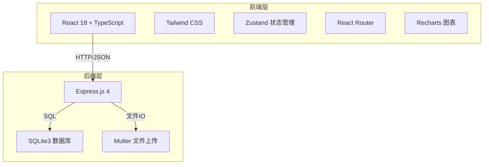
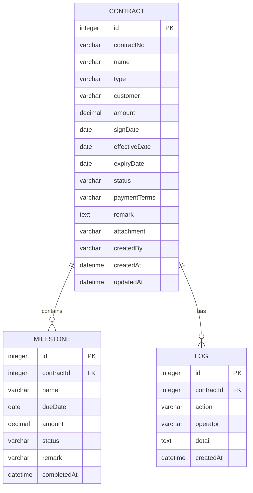

# 合同管理系统 - 技术架构文档

## 1. 架构设计



## 2. 技术选型

- **前端**：React@18 + TypeScript + Tailwind CSS@3 + Vite
- **后端**：Express@4 + TypeScript
- **数据库**：SQLite3（零配置，适合中小型企业部署）
- **状态管理**：Zustand
- **图表库**：Recharts
- **图标库**：Lucide React
- **文件上传**：Multer
- **初始化工具**：vite-init（react-express-ts 模板）

## 3. 路由定义

| 路由 | 用途 |
|------|------|
| / | 仪表盘首页 |
| /contracts | 合同列表 |
| /contracts/new | 新增合同 |
| /contracts/:id | 合同详情 |
| /contracts/:id/edit | 编辑合同 |
| /reminders | 提醒中心 |
| /settings | 系统设置 |

## 4. API 定义

### 4.1 合同相关

| 方法 | 路径 | 说明 |
|------|------|------|
| GET | /api/contracts | 获取合同列表（支持筛选分页）|
| GET | /api/contracts/:id | 获取合同详情 |
| POST | /api/contracts | 创建合同 |
| PUT | /api/contracts/:id | 更新合同 |
| DELETE | /api/contracts/:id | 删除合同 |
| GET | /api/contracts/stats | 获取统计数据 |

### 4.2 提醒相关

| 方法 | 路径 | 说明 |
|------|------|------|
| GET | /api/reminders/upcoming | 获取即将到期合同 |
| GET | /api/reminders/overdue | 获取已逾期合同 |

### 4.3 系统相关

| 方法 | 路径 | 说明 |
|------|------|------|
| GET | /api/settings/types | 获取合同类型 |
| POST | /api/upload | 上传附件 |

## 5. 数据库设计

### 5.1 ER 图



### 5.2 DDL

```sql
-- 合同表
CREATE TABLE contract (
    id INTEGER PRIMARY KEY AUTOINCREMENT,
    contract_no VARCHAR(50) UNIQUE NOT NULL,
    name VARCHAR(200) NOT NULL,
    type VARCHAR(50) NOT NULL,
    customer VARCHAR(200) NOT NULL,
    amount DECIMAL(15,2) DEFAULT 0,
    sign_date DATE,
    effective_date DATE,
    expiry_date DATE NOT NULL,
    status VARCHAR(20) DEFAULT 'draft',
    payment_terms VARCHAR(500),
    remark TEXT,
    attachment VARCHAR(500),
    created_by VARCHAR(100),
    created_at DATETIME DEFAULT CURRENT_TIMESTAMP,
    updated_at DATETIME DEFAULT CURRENT_TIMESTAMP
);

-- 交付节点表
CREATE TABLE milestone (
    id INTEGER PRIMARY KEY AUTOINCREMENT,
    contract_id INTEGER NOT NULL,
    name VARCHAR(200) NOT NULL,
    due_date DATE NOT NULL,
    amount DECIMAL(15,2) DEFAULT 0,
    status VARCHAR(20) DEFAULT 'pending',
    remark VARCHAR(500),
    completed_at DATETIME,
    FOREIGN KEY (contract_id) REFERENCES contract(id) ON DELETE CASCADE
);

-- 操作日志表
CREATE TABLE log (
    id INTEGER PRIMARY KEY AUTOINCREMENT,
    contract_id INTEGER NOT NULL,
    action VARCHAR(50) NOT NULL,
    operator VARCHAR(100),
    detail TEXT,
    created_at DATETIME DEFAULT CURRENT_TIMESTAMP,
    FOREIGN KEY (contract_id) REFERENCES contract(id) ON DELETE CASCADE
);

-- 索引
CREATE INDEX idx_contract_status ON contract(status);
CREATE INDEX idx_contract_expiry ON contract(expiry_date);
CREATE INDEX idx_milestone_contract ON milestone(contract_id);
CREATE INDEX idx_milestone_due ON milestone(due_date);
```

## 6. 项目结构

```
├── src/
│   ├── components/          # 公共组件
│   │   ├── Layout.tsx       # 布局组件
│   │   ├── Sidebar.tsx      # 侧边栏
│   │   ├── Header.tsx       # 顶部导航
│   │   ├── StatCard.tsx     # 统计卡片
│   │   ├── ContractTable.tsx # 合同表格
│   │   ├── ContractForm.tsx # 合同表单
│   │   ├── MilestoneTimeline.tsx # 时间线
│   │   └── ReminderBadge.tsx # 提醒标记
│   ├── pages/               # 页面
│   │   ├── Dashboard.tsx    # 仪表盘
│   │   ├── ContractList.tsx # 合同列表
│   │   ├── ContractDetail.tsx # 合同详情
│   │   ├── ContractEdit.tsx # 合同编辑/新增
│   │   ├── Reminders.tsx    # 提醒中心
│   │   └── Settings.tsx     # 设置
│   ├── hooks/               # 自定义Hooks
│   │   └── useContracts.ts  # 合同数据操作
│   ├── store/               # Zustand状态
│   │   └── contractStore.ts
│   ├── types/               # TypeScript类型
│   │   └── index.ts
│   ├── utils/               # 工具函数
│   │   └── format.ts
│   ├── App.tsx
│   └── main.tsx
├── api/                     # 后端API
│   ├── server.ts            # Express入口
│   ├── routes/
│   │   ├── contracts.ts     # 合同路由
│   │   ├── reminders.ts     # 提醒路由
│   │   └── upload.ts        # 上传路由
│   ├── db.ts                # 数据库连接
│   └── init-db.ts           # 数据库初始化
├── uploads/                 # 上传文件目录
└── package.json
```

## 7. 部署说明

- 开发环境：`npm run dev` 同时启动前端和后端
- 生产构建：`npm run build` 构建前端，`npm run server:prod` 启动生产服务器
- 数据库：SQLite文件存储在项目根目录 `data.db`，自动创建
